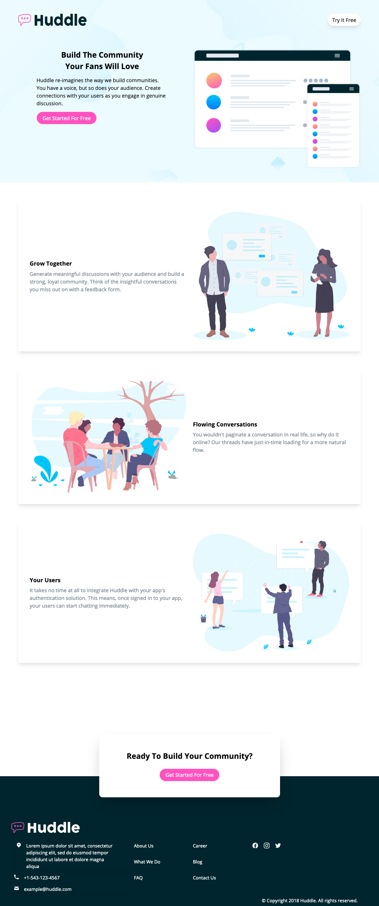
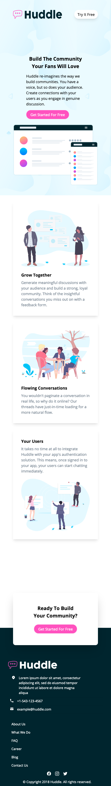
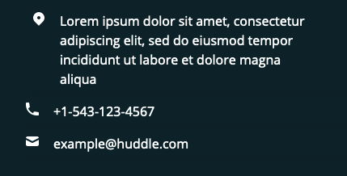

# Frontend Mentor - Huddle landing page with alternating feature blocks solution

This is a solution to the [Huddle landing page with alternating feature blocks challenge on Frontend Mentor](https://www.frontendmentor.io/challenges/huddle-landing-page-with-alternating-feature-blocks-5ca5f5981e82137ec91a5100). Frontend Mentor challenges help you improve your coding skills by building realistic projects. 

## Table of contents

- [Frontend Mentor - Huddle landing page with alternating feature blocks solution](#frontend-mentor---huddle-landing-page-with-alternating-feature-blocks-solution)
  - [Table of contents](#table-of-contents)
  - [Overview](#overview)
    - [The challenge](#the-challenge)
    - [Screenshot](#screenshot)
      - [Desktop](#desktop)
      - [Mobile](#mobile)
    - [Links](#links)
  - [My process](#my-process)
    - [Built with](#built-with)
    - [What I learned](#what-i-learned)
    - [Transforming a box out of the flow.](#transforming-a-box-out-of-the-flow)
    - [Placing two items next to each other with a small space between them.](#placing-two-items-next-to-each-other-with-a-small-space-between-them)
    - [Continued development](#continued-development)
    - [Useful resources](#useful-resources)
  - [Author](#author)
  - [Acknowledgments](#acknowledgments)

## Overview

### The challenge

Users should be able to:

- View the optimal layout for the site depending on their device's screen size
- See hover states for all interactive elements on the page

### Screenshot

#### Desktop


#### Mobile


### Links

- [Solution URL](https://github.com/notapatch/huddle-landing-page-with-alternating-feature-blocks)
- [Live Site URL](https://blissful-thompson-73ee11.netlify.app/)

## My process

I was meant to look at the page and work out which boxes were needed. I missed a shadow around two boxes that meant there needed to be an extra box. Other areas of confusion was the hero section and footer having no margin and the rest needing it.

### Built with

- Semantic HTML5 markup
- CSS custom properties
- Flexbox
- CSS Grid
- Mobile-first workflow
- [Tailwindcss](https://tailwindcss.com/) - For styles

### What I learned

frontendmentor supplied SVGs without viewbox. What this means is that you can't scale them anymore.
A weird situation for a responsive website.

I wanted the order of an flex item to change when changing from mobile to sm(all). I achieved this with Tailwindcss media query with `order-first`.

```html
<h1 class="sm:order-first">Some HTML code I'm proud of</h1>

```

### Transforming a box out of the flow.

When you want a box not to appear in the flow.


```html
<div class="text-center pt-44">
  <div class="transform translate-y-1/3 ">
    <!-- Content -->
  </div>
</div>
```

### Placing two items next to each other with a small space between them.

A common issue is trying to get two inline elements with a constant spacing between them.
An example is shown in the footer. [Tailwindcss has a `space-x` utility class](https://tailwindcss.com/docs/space#class-reference) that does just
that. It's put in the parent element, `li` in this case and the two child elements will have a space added between them. If there were 3 elements there would be two spaces added.



```html
<ul>
  <li class="items-start justify-start space-x-4">
    <span class="flex-none">
      <svg  class="h-5 w-5" viewBox="0 0 20 20" fill="currentColor">..</svg>
    </span>
    <span>
      +1-543-123-4567
    </span>
  </li>
</ul> 
```

### Continued development

Controlling the footer responsively. I used Tailwind's implementation of CSS grid. Along with row-start, row-span (and col-start, col-span) to move box items depending on the breakpoints. It worked but it is something that repeated attempts should make smoother.


### Useful resources

- [Stackoverflow discussion on how to handle SVGs without viewbox and what this means.](https://stackoverflow.com/questions/15335926/how-to-use-the-svg-viewbox-attribute/48031419#48031419) - I was having problems scaling the SVG and I _thought_ it was something to do with missing the viewbox but this SO thread discussed whys.
## Author

- Frontend Mentor - [@notapatch](https://www.frontendmentor.io/profile/notapatch)
- Twitter - [@notapatch](https://www.twitter.com/yourusername)

## Acknowledgments

[TailwindUI (mainly paid, sorry) has a number of solutions to common formatting problems. In this case they had a number of examples of images with text near them which you can dissect.](https://tailwindui.com/)
